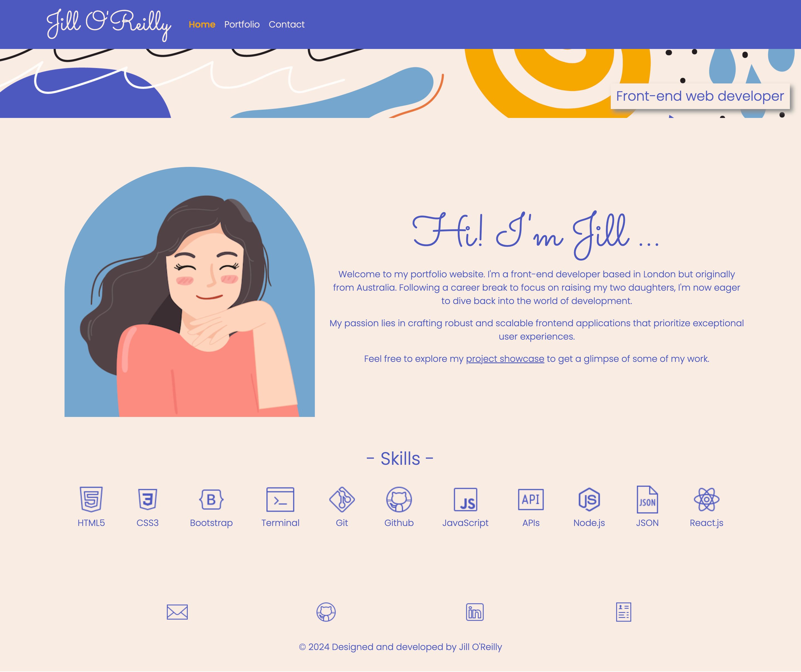
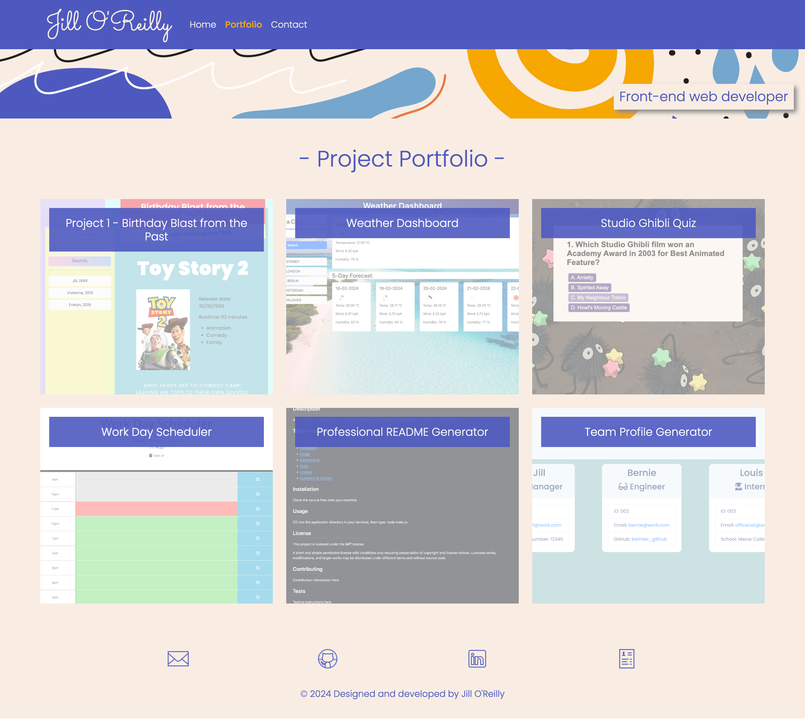
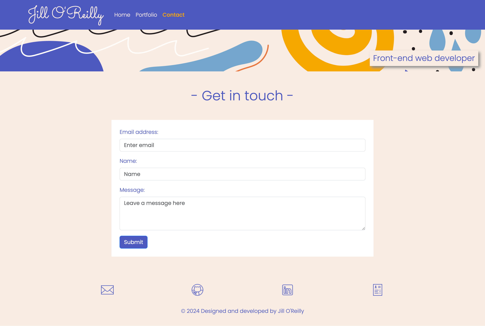

# Jill O'Reilly - React Portfolio

 

  ## Table of contents:
  - [Description](#Description)
  - [Usage](#Usage)
  - [Credits](#Credits)
  - [License](#License)
  - [Technologies Used](#Technologies-used)
  - [Questions & Contact](#Questions--contact)

## Description

A portfolio website built in React, showcasing the projects and skills I have gained from Module 13 (Modern Development with React) of the Front-End Web Development Bootcamp.

## Usage

1. **Jill O'Reillys React Portfolio** can be can be accessed online at [https://jilloreilly.github.io/jill-oreilly-react-portfolio](https://jilloreilly.github.io/jill-oreilly-react-portfolio). The website has been optimised for viewing across all devices.

2. The site consists of:
  - **Home page**: Featuring avatar image, short bio, skills list

  

  - **Portfolio Gallery**: Gallery page showcasing 6 projects

  

  - **Contact**: Contact form

  

  - **Footer**: With links to email, GitHub repository, Linked-in and Resume

## Credits

Thank you to the following:

- [React Bootstrap](https://react-bootstrap.netlify.app/)

- [React Enlightenment](https://www.reactenlightenment.com/)

- [React.dev](https://react.dev/learn)

- Pod 2 TA **Christopher Kratz** for getting us started on the challenge

- **Laura Cole** (Instructor) - for the video guide on how to deploy

- Tutor **Bobbi Tarkany** - the oracle who answered all my questions and fixed my link issues  

## License

MIT License

Copyright (c) 2024 Jill O'Reilly

Permission is hereby granted, free of charge, to any person obtaining a copy
of this software and associated documentation files (the "Software"), to deal
in the Software without restriction, including without limitation the rights
to use, copy, modify, merge, publish, distribute, sublicense, and/or sell
copies of the Software, and to permit persons to whom the Software is
furnished to do so, subject to the following conditions:

The above copyright notice and this permission notice shall be included in all
copies or substantial portions of the Software.

THE SOFTWARE IS PROVIDED "AS IS", WITHOUT WARRANTY OF ANY KIND, EXPRESS OR
IMPLIED, INCLUDING BUT NOT LIMITED TO THE WARRANTIES OF MERCHANTABILITY,
FITNESS FOR A PARTICULAR PURPOSE AND NONINFRINGEMENT. IN NO EVENT SHALL THE
AUTHORS OR COPYRIGHT HOLDERS BE LIABLE FOR ANY CLAIM, DAMAGES OR OTHER
LIABILITY, WHETHER IN AN ACTION OF CONTRACT, TORT OR OTHERWISE, ARISING FROM,
OUT OF OR IN CONNECTION WITH THE SOFTWARE OR THE USE OR OTHER DEALINGS IN THE
SOFTWARE.

## Technologies Used

## Questions & Contact
  - View my GitHub profile here: [jilloreilly](https://github.com/jilloreilly)
  - If you have any additional questions, contact me: [jill.l.oreilly@gmail.com](mailto:jill.l.oreilly@gmail.com)

